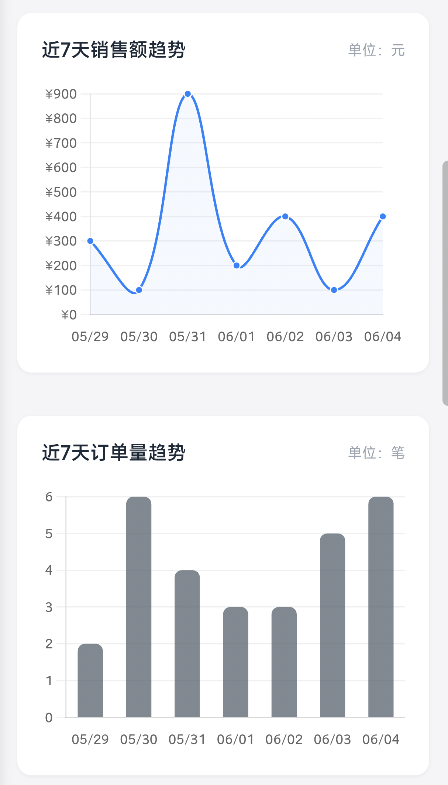
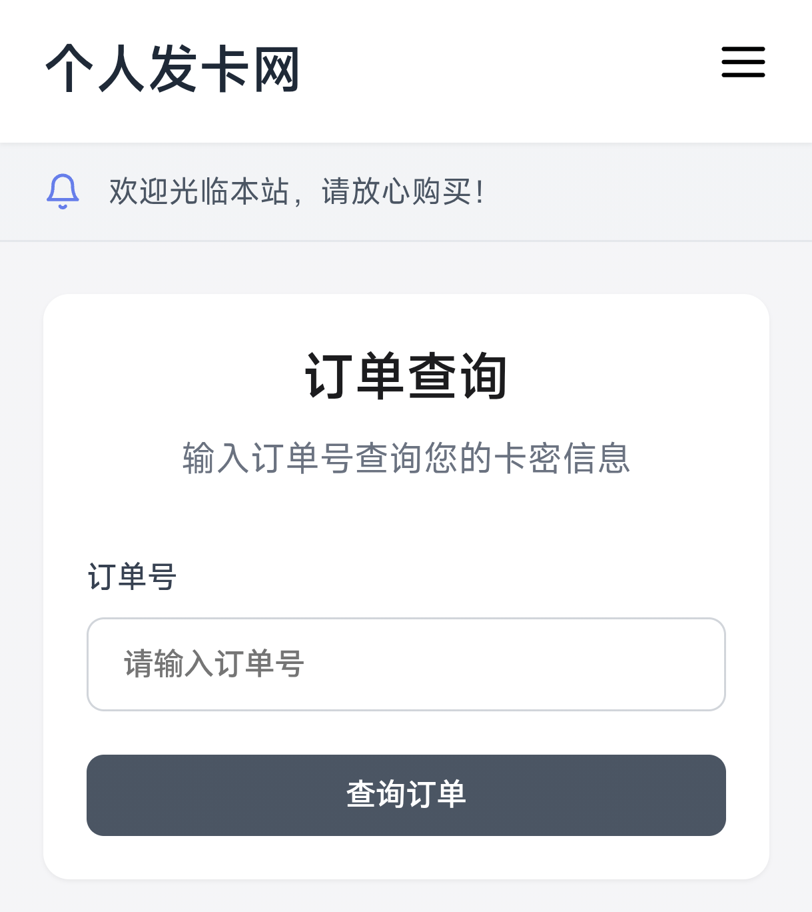
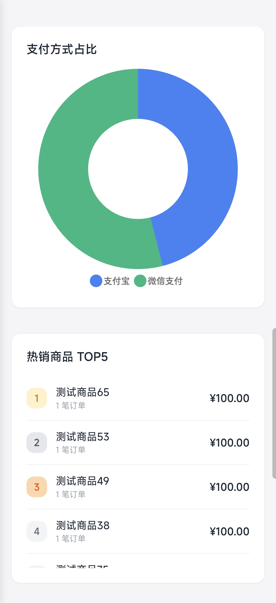
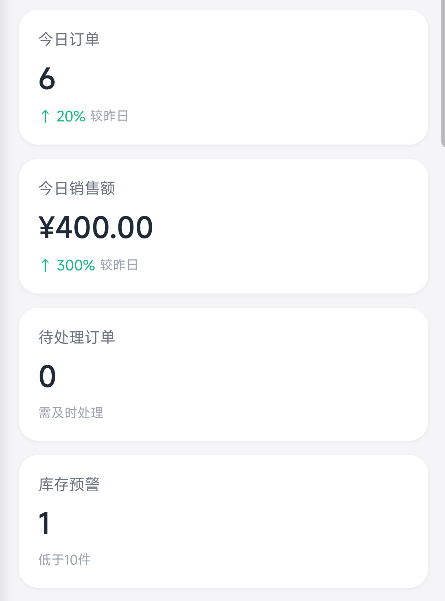
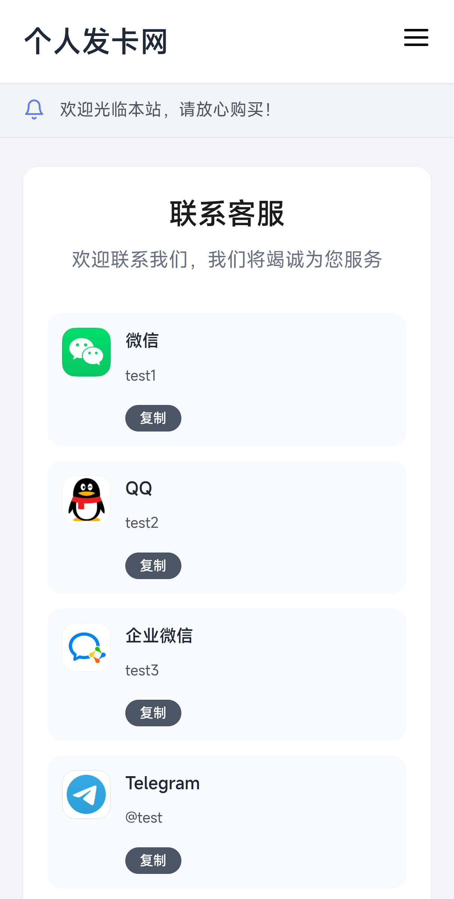

## 介绍

本项目由 **我、Claude、DeepSeek** 共同开发，是一个**轻量级简约H5发卡网**。

如果你的商品需要**自动化发货**，可以考虑使用这个卡网哦喵~

> 在线演示：[https://shop.aplx.top/](https://shop.aplx.top/)
> 管理后台：[https://shop.aplx.top/admin/](https://shop.aplx.top/admin/)
> 测试账号：admin / admin123

> 如果这个项目对您有帮助，麻烦点个Star支持一下，谢谢喵！

## 环境要求

### 服务器配置
- 最低：0.5核心 / 0.5G内存
- 推荐：1-2核心 / 1-2G内存

> 未做高强度并发处理，访问量大的话建议使用更专业的发卡网喵

### PHP版本
- 最低：PHP 7.4
- 推荐：PHP 8.0 - 8.2

### MySQL版本
- 最低：MySQL 5.7
- 推荐：MySQL 8.0

## 安装步骤

1. 上传源码到服务器
2. 直接访问域名，自动进入安装程序
3. 填写数据库信息和管理员账号
4. 配置支付信息（可留空，后续在后台设置）
5. 安装完成，自动跳转首页

> 安装程序会自动创建数据库表和配置文件，无需手动操作喵

## 功能亮点

- 专业数据仪表盘（销售额趋势、订单统计、支付占比、热销商品）
- 自动化发卡（支付成功后自动发货）
- 响应式设计（主要适配手机端，电脑端没太关注喵）
- 完整后台管理（商品、分类、库存、订单、支付配置）

## 温馨提示

- 安装程序未做环境检测，请**自行确认环境符合要求**后再部署喵
- 卡网名称由你自定义喵
- **完全免费**，代码全开源，无广告、无后门喵
- 项目由AI辅助，建议自行大致复查一遍喵

## 功能截图

### 仪表盘

### 商品管理

### 订单查询

### 数据统计

### 联系方式

> 如果觉得好用，可以考虑赞助支持一下喵~ qwq